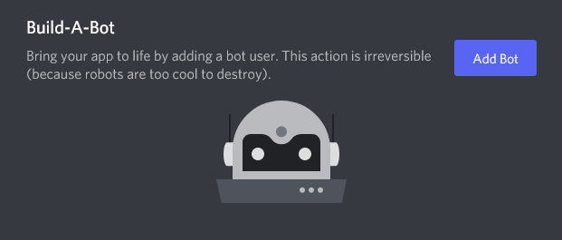

Using in Direct Messages
========================

Slash commands can be used in direct messages, even with webhook-based bots like those built with Flask-Discord-Interactions. However, there are some extra steps required to make this work, and there are some differences with the :class:`.Context` objects you will receive from this library.

Setup
-----

By default, Discord users cannot send a direct message to a Webhook-only bot. In order to enable users to DM your bot, you need to create a "Bot User" in the developer portal. Click the "Add Bot" button:

Next, you need to make sure that any commands you want to use in a DM are global commands. By default, the examples in this library only publish commands to a specific testing guild. If you have a line like this:

.. code-block:: python

    discord.update_commands(guild_id=os.environ["TESTING_GUILD"])

Replace it with this:

.. code-block:: python

    discord.update_commands()

This will register your commands globally instead of in one specific guild.

:class:`.Context` Objects in DM
-------------------------------

Most of your commands should "just work" inside of a DM. That said, the Context object you will receive from a DM interaction will be different from what you would receive from an interaction in a server.

No ``guild_id`` field
^^^^^^^^^^^^^^^^^^^^^

:attr:`.Context.guild_id` will be ``None``.

:attr:`.Context.author` is a :class:`.User`, not a :class:`.Member`
^^^^^^^^^^^^^^^^^^^^^^^^^^^^^^^^^^^^^^^^^^^^^^^^^^^^^^^^^^^^^^^^^^^

The invoking user will be represented by a :class:`.User` class, not a :class:`.Member` class. These classes are similar, but the :class:`.User` class has fewer attributes: you will not receive any guild-specific information about the user (join timestamp, nitro boost status, permissions integer, nickname, etc).

You will still have access to a user's avatar URL, username, discriminator, ID, etc. Additionally, you can still use :meth:`.User.display_name` to get the username.
