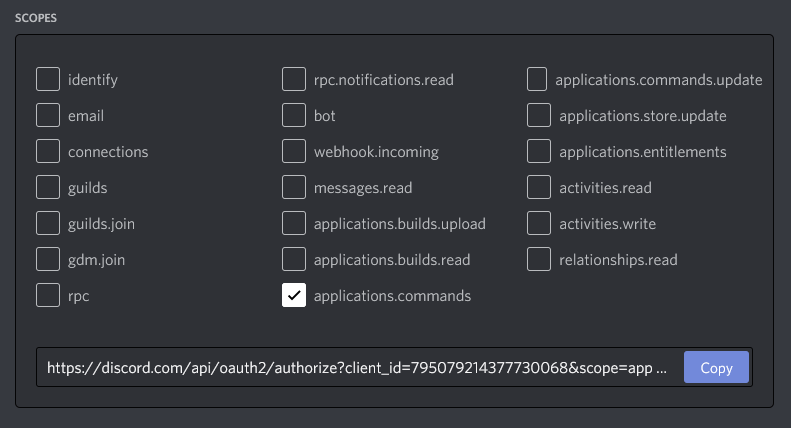
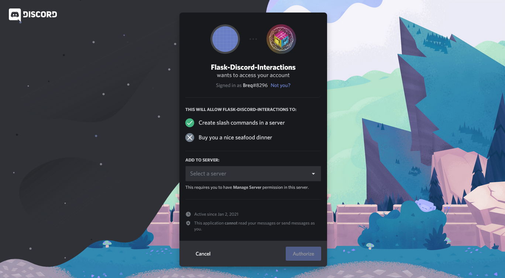
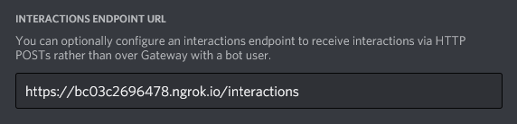

Bot Setup Tutorial
==================

Create an application
------------------------

Create an application in the `Discord Developer Portal <https://discord.com/developers/applications>`_. The name and avatar you set here will be the name and avatar of your bot. **You do not need to create a "Bot user"** like you would with a traditional Discord bot.

Authorize the application
----------------------------

Authorize the application to create slash commands in one of your servers. In the Developer Portal, go to the OAuth2 tab, click the "applications.commands" checkbox, and copy the URL. (You don't need the "bot" scope--that one is for traditional WebSocket-based Discord bots.)

Go to this URL, and you'll be prompted to select a server and click "Authorize". Select the testing server you want to add your bot to. (You can always go back and add more servers later.)

Set your environment variables
---------------------------------

The library requires your client ID, public key (to authenticate incoming requests), and client secret (to register new commands). You can find all three in the "General Information" section of the Developer Portal. Store them in the ``DISCORD_CLIENT_ID``, ``DISCORD_PUBLIC_KEY``, and ``DISCORD_CLIENT_SECRET`` environment variables.

If you're new to environment variables, Twilio has a nice `guide <https://www.twilio.com/blog/2017/01/how-to-set-environment-variables.html)>`_. For deploying on Heroku/Dokku/etc, refer to their documentation on how to set environment variables.

.. code-block:: bash

    export DISCORD_CLIENT_ID=795079214377730068
    export DISCORD_PUBLIC_KEY=4ed566bf47318ee9482be3e11669d715520350b9f68672f339eee2f31a6822e1
    export DISCORD_CLIENT_SECRET=[your secret here]

The example also uses the environment variable `TESTING_GUILD` to store the ID of the server you want to add commands to. Discord has an `article <https://support.discord.com/hc/en-us/articles/206346498-Where-can-I-find-my-User-Server-Message-ID->`_ about how to find the server ID using developer mode.

.. code-block:: bash

    export TESTING_GUILD=197777408198180864

Run the program
---------------

You should be able to run an example program without any errors now. It should register slash commands in your server. However, these slash commands will not work yet.

Here's a quick "hello world" program, or you can look in the project examples directory.

.. code-block:: python

    import os

    from flask import Flask
    from flask_discord_interactions import DiscordInteractions

    app = Flask(__name__)
    discord = DiscordInteractions(app)

    app.config["DISCORD_CLIENT_ID"] = os.environ["DISCORD_CLIENT_ID"]
    app.config["DISCORD_PUBLIC_KEY"] = os.environ["DISCORD_PUBLIC_KEY"]
    app.config["DISCORD_CLIENT_SECRET"] = os.environ["DISCORD_CLIENT_SECRET"]

    @discord.command()
    def ping(ctx):
        "Respond with a friendly 'pong'!"
        return "Pong!"

    discord.set_route("/interactions")

    discord.update_slash_commands(guild_id=os.environ["TESTING_GUILD"])

    if __name__ == '__main__':
        app.run()

Expose your server to the Internet
----------------------------------

In order for Discord to reach your bot, it has to be reachable on the public Internet. This step will depend on how you are running your code.

Testing
^^^^^^^

For testing on your local machine, you will need to proxy traffic from a public address to your computer. Services like `ngrok <https://ngrok.com/>`_ can do this for you. Follow the guide to sign up and install, then use the command ``./ngrok http 5000`` to create a tunnel (assuming your Flask app is running on port 5000). The terminal should display a public URL (something like ``https://92832de0.ngrok.io``). Make sure you use the HTTPS one, as Discord will not send interactions over HTTP. Leave ngrok running in the background while you run your bot.

Deployment
^^^^^^^^^^

If you are using something like `Heroku <https://devcenter.heroku.com/articles/getting-started-with-python>`_ or `Dokku <http://dokku.viewdocs.io/dokku/>`_, your public URL should be visible when you deploy the app, something like ``https://serene-caverns-82714.herokuapp.com/``. If you are deploying directly to a cloud VPS with a public IP address, the steps are outlined in this `DigitalOcean <https://www.digitalocean.com/community/tutorials/how-to-serve-flask-applications-with-gunicorn-and-nginx-on-ubuntu-18-04>`_ tutorial (it should be similar for most providers). You could also deploy to a local machine and use a service like `No-IP <https://www.noip.com/support/knowledgebase/getting-started-with-no-ip-com/>`_ to expose it to the Internet.

Tell Discord where to send interactions
---------------------------------------

You need to provide Discord with your public URL so they can send you interactions. This setting is located in the "General Information" section of the Developer Portal.

*Note that the example uses the /interactions endpoint to receive interactions.*

Click the "Save Changes" box at the bottom. Note that if your bot is not configured properly, the Developer Portal will not allow you to save the URL.

That's all!
-----------

At this point, you should be able to use Slash Commands and receive a response from your bot. If you have any issues, `you know where to put them <https://github.com/Breq16/flask-discord-interactions/issues>`_!